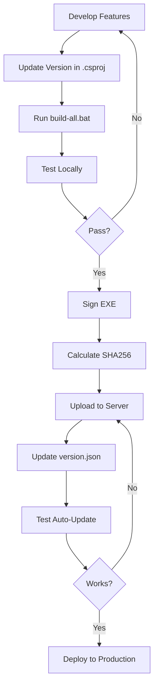
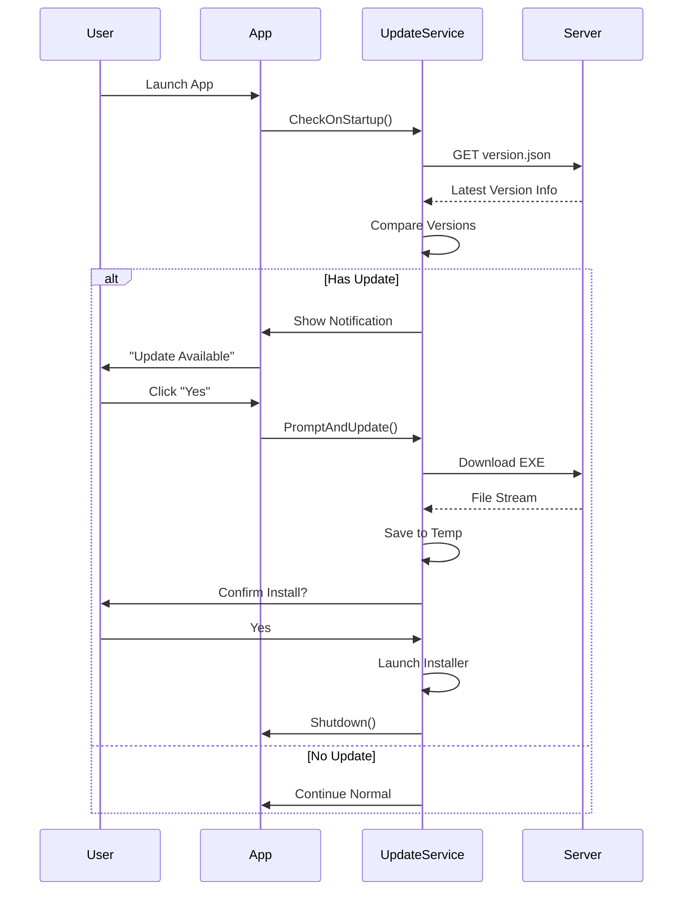

# Auto-Update System - Hướng Dẫn Chi Tiết

## 📋 Tổng Quan

Hệ thống auto-update cho phép ứng dụng SRT2Speech tự động kiểm tra và cài đặt phiên bản mới mà không cần người dùng tải về thủ công.

## 🏗️ Kiến Trúc

```
┌─────────────────┐
│   MainWindow    │
│                 │
│  ┌───────────┐  │
│  │ Menu Bar  │  │◄─── "Trợ giúp > Kiểm tra cập nhật"
│  └─────┬─────┘  │
│        │        │
│  ┌─────▼──────┐ │
│  │  Update    │ │
│  │  Service   │ │
│  └─────┬──────┘ │
└────────┼────────┘
         │
         ├──► Check version.json từ server
         │
         ├──► So sánh với version hiện tại
         │
         ├──► Download file .exe mới
         │
         └──► Launch installer & restart
```

## 📁 Cấu Trúc Files

```
SRT2Speech.AppWindow/
├── Models/
│   └── UpdateInfo.cs              # Model thông tin cập nhật
├── Services/
│   └── UpdateService.cs           # Service xử lý cập nhật
├── Views/
│   ├── UpdateProgressWindow.xaml  # UI hiển thị tiến trình
│   └── UpdateProgressWindow.xaml.cs
├── MainWindow.xaml                # Thêm Menu "Trợ giúp"
├── MainWindow.xaml.cs             # Event handlers
└── SRT2Speech.AppWindow.csproj    # Version info

docs/
├── version.json.example           # Template cho server
└── auto-update-guide.md          # File này
```

## 🔧 Implementation Details

### 1. UpdateInfo Model

```csharp
public class UpdateInfo
{
    public string LatestVersion { get; set; }      // "1.1.0"
    public DateTime ReleaseDate { get; set; }      // Ngày phát hành
    public string DownloadUrl { get; set; }        // URL tải về
    public List<string> Changelog { get; set; }    // Danh sách thay đổi
    public string MinimumVersion { get; set; }     // Version tối thiểu
    public bool ForceUpdate { get; set; }          // Bắt buộc cập nhật
    public bool HasUpdate { get; set; }            // Có update không
    public long FileSize { get; set; }             // Kích thước file
}
```

### 2. UpdateService Methods

#### GetCurrentVersion()

```csharp
public Version GetCurrentVersion()
{
    var assembly = Assembly.GetExecutingAssembly();
    return assembly.GetName().Version ?? new Version(1, 0, 0);
}
```

#### CheckForUpdatesAsync()

```csharp
public async Task<UpdateInfo?> CheckForUpdatesAsync()
{
    // 1. Tải version.json từ server
    var response = await _httpClient.GetStringAsync(_updateCheckUrl);

    // 2. Parse JSON
    var updateInfo = JsonSerializer.Deserialize<UpdateInfo>(response);

    // 3. So sánh version
    var currentVersion = GetCurrentVersion();
    var latestVersion = Version.Parse(updateInfo.LatestVersion);

    // 4. Return nếu có update
    if (latestVersion > currentVersion)
    {
        updateInfo.HasUpdate = true;
        return updateInfo;
    }

    return null;
}
```

#### DownloadAndInstallAsync()

```csharp
public async Task<bool> DownloadAndInstallAsync(UpdateInfo updateInfo)
{
    // 1. Tải file về Temp folder
    var tempFile = Path.Combine(Path.GetTempPath(), "SRT2Speech-Update.exe");

    // 2. Download với progress tracking
    using var response = await _httpClient.GetAsync(downloadUrl);
    using var fileStream = new FileStream(tempFile, FileMode.Create);
    await response.Content.CopyToAsync(fileStream);

    // 3. Launch installer
    Process.Start(tempFile);

    // 4. Close current app
    Application.Current.Shutdown();
}
```

### 3. MainWindow Integration

```csharp
public partial class MainWindow : Window
{
    private UpdateService? _updateService;

    private void InitializeUpdateService()
    {
        _updateService = new UpdateService();

        // Check on startup (background)
        _ = Task.Run(async () =>
        {
            await _updateService.CheckOnStartupAsync(updateInfo =>
            {
                Dispatcher.Invoke(() => ShowUpdateNotification(updateInfo));
            });
        });
    }

    private async void MenuItemCheckUpdate_Click(object sender, RoutedEventArgs e)
    {
        await _updateService.PromptAndUpdateAsync();
    }
}
```

## 🌐 Server Setup

### Option 1: Static File Server

**Nginx Configuration:**

```nginx
server {
    listen 443 ssl;
    server_name yourdomain.com;

    location /api/version.json {
        root /var/www/updates;
        add_header Access-Control-Allow-Origin *;
    }

    location /downloads/ {
        root /var/www/updates;
        add_header Content-Type application/octet-stream;
    }
}
```

**Directory Structure:**

```
/var/www/updates/
├── api/
│   └── version.json
└── downloads/
    ├── SRT2Speech-1.0.0.exe
    ├── SRT2Speech-1.1.0.exe
    └── SRT2Speech-1.2.0.exe
```

### Option 2: GitHub Releases

**Advantages:**

- ✅ Free hosting
- ✅ Version control
- ✅ Automatic changelog
- ✅ CDN delivery

**Setup:**

1. Tạo Release mới trên GitHub
2. Upload file `.exe` vào Assets
3. Get download URL từ release
4. Update `version.json`

**GitHub API:**

```bash
curl https://api.github.com/repos/username/repo/releases/latest
```

### Option 3: Azure Blob Storage

**Advantages:**

- ✅ Scalable
- ✅ Fast CDN
- ✅ Pay-as-you-go

**Setup:**

```bash
# Upload file
az storage blob upload \
  --account-name youraccount \
  --container-name updates \
  --name SRT2Speech-1.1.0.exe \
  --file ./Release/SRT2Speech.exe
```

## 🔐 Security Best Practices

### 1. HTTPS Only

```csharp
// Chỉ cho phép HTTPS
if (!_updateCheckUrl.StartsWith("https://"))
{
    throw new SecurityException("Update URL must use HTTPS");
}
```

### 2. File Hash Verification

```csharp
public async Task<bool> VerifyFileHash(string filePath, string expectedHash)
{
    using var sha256 = SHA256.Create();
    using var stream = File.OpenRead(filePath);
    var hash = await sha256.ComputeHashAsync(stream);
    var hashString = BitConverter.ToString(hash).Replace("-", "");
    return hashString.Equals(expectedHash, StringComparison.OrdinalIgnoreCase);
}
```

### 3. Digital Signature

```bash
# Sign file với certificate
signtool sign /f certificate.pfx /p password /t http://timestamp.digicert.com SRT2Speech.exe
```

### 4. Update version.json với hash

```json
{
  "latestVersion": "1.1.0",
  "downloadUrl": "https://...",
  "sha256Hash": "ABC123...",
  "signature": "XYZ789..."
}
```

## 📊 Workflow

### Development → Production



### User Update Flow



## 🧪 Testing

### 1. Test Checklist

- [ ] Kiểm tra version được đọc đúng
- [ ] Server trả về version.json hợp lệ
- [ ] Download file thành công
- [ ] Progress bar cập nhật đúng
- [ ] Installer chạy được
- [ ] App restart sau update
- [ ] Version mới hiển thị đúng

### 2. Test Script

```csharp
[Test]
public async Task TestVersionCheck()
{
    var service = new UpdateService();
    var currentVersion = service.GetCurrentVersion();
    Assert.IsNotNull(currentVersion);
    Assert.Greater(currentVersion.Major, 0);
}

[Test]
public async Task TestUpdateCheck()
{
    var service = new UpdateService("https://test-server/version.json");
    var updateInfo = await service.CheckForUpdatesAsync();
    // Test based on mock server response
}
```

### 3. Manual Testing

```bash
# 1. Start local test server
python -m http.server 8000

# 2. Serve test version.json
curl http://localhost:8000/version.json

# 3. Run app and trigger update check
# 4. Verify all steps work correctly
```

## 🐛 Troubleshooting

### Issue: "Cannot connect to update server"

**Causes:**

- Network connectivity
- Firewall blocking
- Server down
- Invalid URL

**Debug:**

```csharp
try
{
    var response = await _httpClient.GetAsync(_updateCheckUrl);
    Debug.WriteLine($"Status: {response.StatusCode}");
    Debug.WriteLine($"Content: {await response.Content.ReadAsStringAsync()}");
}
catch (Exception ex)
{
    Debug.WriteLine($"Error: {ex.Message}");
}
```

### Issue: "Download failed"

**Causes:**

- Insufficient disk space
- Permission denied
- Incomplete download
- Corrupted file

**Fix:**

```csharp
// Add retry logic
var policy = Policy
    .Handle<HttpRequestException>()
    .WaitAndRetryAsync(3, retryAttempt =>
        TimeSpan.FromSeconds(Math.Pow(2, retryAttempt)));

await policy.ExecuteAsync(async () =>
{
    await DownloadFileAsync(url, destination);
});
```

### Issue: "Installer won't run"

**Causes:**

- Antivirus blocking
- Missing admin rights
- File not signed
- Corrupted EXE

**Fix:**

```csharp
// Request admin elevation
var startInfo = new ProcessStartInfo
{
    FileName = installerPath,
    UseShellExecute = true,
    Verb = "runas" // Request admin
};
Process.Start(startInfo);
```

## 📈 Metrics & Analytics

### Track Update Success Rate

```csharp
public class UpdateMetrics
{
    public int CheckCount { get; set; }
    public int UpdateAvailableCount { get; set; }
    public int DownloadStartCount { get; set; }
    public int DownloadSuccessCount { get; set; }
    public int InstallSuccessCount { get; set; }
    public List<string> Errors { get; set; }
}
```

### Log to Analytics

```csharp
await analyticsService.TrackEvent("UpdateChecked", new
{
    CurrentVersion = currentVersion,
    LatestVersion = updateInfo.LatestVersion,
    HasUpdate = updateInfo.HasUpdate
});
```

## 🚀 Advanced Features

### 1. Rollback Support

```json
{
  "latestVersion": "1.2.0",
  "rollbackVersion": "1.1.0",
  "canRollback": true
}
```

### 2. Staged Rollout

```json
{
  "latestVersion": "1.2.0",
  "rolloutPercentage": 25,
  "rolloutGroups": ["beta", "premium"]
}
```

### 3. Delta Updates

```json
{
  "latestVersion": "1.2.0",
  "deltaFrom": "1.1.0",
  "deltaUrl": "https://.../delta-1.1.0-to-1.2.0.patch",
  "deltaSize": 5242880
}
```

## 📚 References

- [Semantic Versioning](https://semver.org/)
- [.NET Assembly Versioning](https://docs.microsoft.com/en-us/dotnet/standard/assembly/versioning)
- [Code Signing Best Practices](https://docs.microsoft.com/en-us/windows/win32/seccrypto/cryptography-tools)
- [GitHub Releases API](https://docs.github.com/en/rest/releases)

## ✅ Checklist cho Production

- [ ] Version được set đúng trong `.csproj`
- [ ] Build thành công với `PublishSingleFile=true`
- [ ] File EXE được sign với certificate
- [ ] SHA256 hash được tính toán
- [ ] Upload file lên server
- [ ] Update `version.json` với thông tin mới
- [ ] Test update từ version cũ
- [ ] Verify app restart correctly
- [ ] Check logs không có lỗi
- [ ] Monitor first 24h sau release

---

**Last Updated:** 2024-11-15  
**Version:** 1.0.0
