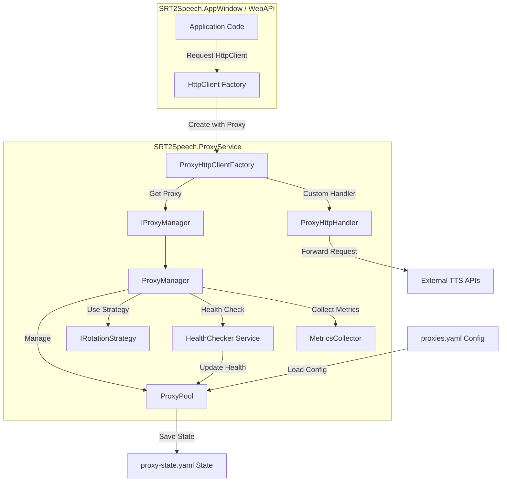

# Kế Hoạch Triển Khai Proxy Rotation Service

## 📋 Tổng Quan

**Dự án:** SRT2Speech.ProxyService  
**Mục đích:** Tránh rate limiting khi gọi TTS APIs (FPT, Vbee, ElevenLabs, Google)  
**Kiến trúc:** Class Library độc lập, tích hợp qua HttpClient Factory và Dependency Injection  
**Nguồn Proxy:** User-provided proxy list (từ dịch vụ trả phí: Bright Data, Oxylabs, etc.)

---

## 🎯 Yêu Cầu Chính

### Functional Requirements

1. ✅ Rotate proxy tự động khi gọi HTTP requests
2. ✅ Hỗ trợ nhiều rotation strategies (RoundRobin, Random, LeastUsed, Weighted)
3. ✅ Health checking tự động để loại bỏ proxy chết
4. ✅ Retry với proxy khác khi request fail
5. ✅ Lưu trữ và khôi phục trạng thái proxy
6. ✅ Metrics và monitoring
7. ✅ Configuration qua YAML file

### Non-Functional Requirements

1. ✅ Thread-safe cho concurrent requests
2. ✅ Performance cao, minimal overhead
3. ✅ Dễ dàng tích hợp vào AppWindow và WebAPI
4. ✅ Tuân theo patterns hiện có trong dự án
5. ✅ Logging chi tiết cho debugging

---

## 🏗️ Kiến Trúc Tổng Thể



### Luồng Hoạt Động

1. **Initialization Phase**

   - Load proxy configuration từ `proxies.yaml`
   - Khôi phục trạng thái từ `proxy-state.yaml` (nếu có)
   - Start background health checker service
   - Register services vào DI container

2. **Request Phase**

   - Application request HttpClient từ factory
   - ProxyManager chọn proxy theo strategy
   - Tạo HttpClient với ProxyHttpHandler
   - Execute request qua proxy
   - Thu thập metrics (response time, success/fail)

3. **Failure Handling Phase**

   - Nếu request fail → Mark proxy với consecutive failure count
   - Retry với proxy khác (theo Polly policy)
   - Nếu proxy fail nhiều lần → Mark as unhealthy
   - Health checker sẽ revalidate proxy sau cooldown period

4. **Background Maintenance Phase**
   - Health checker chạy mỗi 30 giây
   - Test các proxy unhealthy để revalidate
   - Update metrics và statistics
   - Auto-save state mỗi 5 phút hoặc khi dispose

---

## 📦 Cấu Trúc Project

```
SRT2Speech.ProxyService/
│
├── SRT2Speech.ProxyService.csproj
│
├── Models/
│   ├── ProxyInfo.cs                    # Model chính cho proxy
│   ├── ProxyHealth.cs                  # Health status và metrics
│   ├── ProxyMetrics.cs                 # Performance metrics
│   ├── ProxyConfiguration.cs           # Root config model
│   ├── ProxySettings.cs                # Settings từ appsettings
│   └── ProxyState.cs                   # State để persist
│
├── Enums/
│   ├── ProxyType.cs                    # HTTP, HTTPS, SOCKS5
│   ├── ProxyStatus.cs                  # Active, Unhealthy, Disabled
│   └── RotationStrategy.cs             # Các strategy types
│
├── Interfaces/
│   ├── IProxyManager.cs                # Core manager interface
│   ├── IProxyPool.cs                   # Proxy pool interface
│   ├── IRotationStrategy.cs            # Strategy pattern interface
│   ├── IProxyHealthChecker.cs          # Health checker interface
│   └── IProxyMetricsCollector.cs       # Metrics collector interface
│
├── Services/
│   ├── ProxyManager.cs                 # Main proxy management logic
│   ├── ProxyPool.cs                    # Thread-safe proxy collection
│   ├── ProxyHealthChecker.cs           # Background health checking
│   ├── ProxyMetricsCollector.cs        # Metrics collection và aggregation
│   └── ProxyStateManager.cs            # Save/Load state persistence
│
├── Strategies/
│   ├── RoundRobinStrategy.cs           # Sequential rotation
│   ├── RandomStrategy.cs               # Random selection
│   ├── LeastUsedStrategy.cs            # Least used proxy first
│   ├── WeightedStrategy.cs             # Weight-based selection
│   └── SmartStrategy.cs                # Performance-based smart selection
│
├── HttpHandlers/
│   ├── ProxyHttpClientHandler.cs       # Custom HttpClientHandler
│   └── ProxyRetryHandler.cs            # DelegatingHandler với retry logic
│
├── Extensions/
│   ├── ServiceCollectionExtensions.cs  # DI registration helpers
│   └── HttpClientBuilderExtensions.cs  # HttpClient builder extensions
│
├── Configuration/
│   └── ProxyServiceOptions.cs          # Options pattern configuration
│
└── Exceptions/
    ├── ProxyException.cs               # Base exception
    ├── NoAvailableProxyException.cs    # No healthy proxy available
    └── ProxyConfigurationException.cs  # Configuration error
```

---

## 🔧 Chi Tiết Thiết Kế

### 1. Models

#### ProxyInfo.cs

```csharp
namespace SRT2Speech.ProxyService.Models
{
    public class ProxyInfo
    {
        // Identity
        public string Id { get; set; } = Guid.NewGuid().ToString();
        public string Name { get; set; } = string.Empty;

        // Connection Details
        public string Host { get; set; } = string.Empty;
        public int Port { get; set; }
        public ProxyType Type { get; set; } = ProxyType.HTTP;

        // Authentication
        public string? Username { get; set; }
        public string? Password { get; set; }

        // Status và Health
        public ProxyStatus Status { get; set; } = ProxyStatus.Active;
        public ProxyHealth Health { get; set; } = new();

        // Usage Tracking
        public int UsedCount { get; set; }
        public DateTime? LastUsed { get; set; }
        public DateTime? LastHealthCheck { get; set; }

        // Configuration
        public int Priority { get; set; } = 100;
        public int Weight { get; set; } = 100;
        public TimeSpan? CooldownUntil { get; set; }

        // Metadata
        public Dictionary<string, string> Tags { get; set; } = new();

        // Helper Methods
        public bool IsAvailable()
        {
            return Status == ProxyStatus.Active
                && (!CooldownUntil.HasValue || DateTime.UtcNow >= CooldownUntil.Value)
                && Health.ConsecutiveFailures < 5;
        }

        public string GetProxyUrl()
        {
            var scheme = Type switch
            {
                ProxyType.HTTP => "http",
                ProxyType.HTTPS => "https",
                ProxyType.SOCKS5 => "socks5",
                _ => "http"
            };

            if (!string.IsNullOrEmpty(Username))
            {
                return $"{scheme}://{Username}:{Password}@{Host}:{Port}";
            }
            return $"{scheme}://{Host}:{Port}";
        }
    }
}
```

#### ProxyHealth.cs

```csharp
namespace SRT2Speech.ProxyService.Models
{
    public class ProxyHealth
    {
        // Health Status
        public bool IsHealthy { get; set; } = true;
        public DateTime? LastHealthyTime { get; set; }

        // Failure Tracking
        public int ConsecutiveFailures { get; set; }
        public int TotalFailures { get; set; }
        public DateTime? LastFailureTime { get; set; }
        public string? LastFailureReason { get; set; }

        // Success Tracking
        public int TotalSuccesses { get; set; }
        public DateTime? LastSuccessTime { get; set; }

        // Performance Metrics
        public double AverageResponseTime { get; set; }
        public double SuccessRate { get; set; }
        public int HealthScore { get; set; } = 100; // 0-100

        // Methods
        public void RecordSuccess(TimeSpan responseTime)
        {
            ConsecutiveFailures = 0;
            TotalSuccesses++;
            LastSuccessTime = DateTime.UtcNow;
            LastHealthyTime = DateTime.UtcNow;
            IsHealthy = true;

            // Update average response time (rolling average)
            AverageResponseTime = AverageResponseTime == 0
                ? responseTime.TotalMilliseconds
                : (AverageResponseTime * 0.7 + responseTime.TotalMilliseconds * 0.3);

            UpdateHealthScore();
        }

        public void RecordFailure(string reason)
        {
            ConsecutiveFailures++;
            TotalFailures++;
            LastFailureTime = DateTime.UtcNow;
            LastFailureReason = reason;

            if (ConsecutiveFailures >= 3)
            {
                IsHealthy = false;
            }

            UpdateHealthScore();
        }

        private void UpdateHealthScore()
        {
            var total = TotalSuccesses + TotalFailures;
            if (total > 0)
            {
                SuccessRate = (double)TotalSuccesses / total * 100;

                // Health score based on success rate and consecutive failures
                HealthScore = (int)(SuccessRate * 0.7) - (ConsecutiveFailures * 10);
                HealthScore = Math.Max(0, Math.Min(100, HealthScore));
            }
        }
    }
}
```

#### ProxyMetrics.cs

```csharp
namespace SRT2Speech.ProxyService.Models
{
    public class ProxyMetrics
    {
        public string ProxyId { get; set; } = string.Empty;

        // Request Statistics
        public long TotalRequests { get; set; }
        public long SuccessfulRequests { get; set; }
        public long FailedRequests { get; set; }

        // Timing Statistics
        public double MinResponseTime { get; set; }
        public double MaxResponseTime { get; set; }
        public double AverageResponseTime { get; set; }
        public double P95ResponseTime { get; set; }

        // Bandwidth (optional)
        public long TotalBytesReceived { get; set; }
        public long TotalBytesSent { get; set; }

        // Time-based metrics
        public DateTime FirstUsed { get; set; }
        public DateTime LastUsed { get; set; }
        public TimeSpan TotalUptime { get; set; }

        // Rate limiting info
        public DateTime? LastRateLimitHit { get; set; }
        public int RateLimitHitCount { get; set; }
    }
}
```

#### ProxyConfiguration.cs

```csharp
namespace SRT2Speech.ProxyService.Models
{
    public class ProxyConfiguration
    {
        public List<ProxyInfo> Proxies { get; set; } = new();
        public ProxyServiceSettings Settings { get; set; } = new();
        public DateTime LoadedAt { get; set; }
        public string Version { get; set; } = "1.0";
    }

    public class ProxyServiceSettings
    {
        // Rotation Settings
        public RotationStrategy DefaultStrategy { get; set; } = RotationStrategy.RoundRobin;

        // Health Check Settings
        public bool EnableHealthCheck { get; set; } = true;
        public int HealthCheckIntervalSeconds { get; set; } = 30;
        public string HealthCheckUrl { get; set; } = "https://httpbin.org/ip";
        public int HealthCheckTimeoutSeconds { get; set; } = 10;

        // Retry Settings
        public int MaxRetries { get; set; } = 3;
        public int RetryDelayMilliseconds { get; set; } = 1000;

        // Cooldown Settings
        public int DefaultCooldownMinutes { get; set; } = 5;
        public int MaxConsecutiveFailures { get; set; } = 5;

        // State Persistence
        public bool EnableStatePersistence { get; set; } = true;
        public int StateSaveIntervalMinutes { get; set; } = 5;
        public string StateFilePath { get; set; } = "Configs/proxy-state.yaml";

        // Logging
        public bool EnableDetailedLogging { get; set; } = false;
    }
}
```

#### ProxyState.cs

```csharp
namespace SRT2Speech.ProxyService.Models
{
    public class ProxyState
    {
        public List<ProxyInfo> Proxies { get; set; } = new();
        public DateTime LastSaved { get; set; }
        public RotationStrategy Strategy { get; set; }
        public Dictionary<string, ProxyMetrics> Metrics { get; set; } = new();
    }
}
```

### 2. Enums

#### ProxyType.cs

```csharp
namespace SRT2Speech.ProxyService.Enums
{
    public enum ProxyType
    {
        HTTP,
        HTTPS,
        SOCKS5
    }
}
```

#### ProxyStatus.cs

```csharp
namespace SRT2Speech.ProxyService.Enums
{
    public enum ProxyStatus
    {
        Active,      // Proxy đang hoạt động bình thường
        Unhealthy,   // Proxy có vấn đề nhưng vẫn có thể retry
        Disabled,    // Proxy bị vô hiệu hóa thủ công
        Testing      // Đang trong quá trình health check
    }
}
```

#### RotationStrategy.cs

```csharp
namespace SRT2Speech.ProxyService.Enums
{
    public enum RotationStrategy
    {
        RoundRobin,      // Xoay vòng tuần tự
        Random,          // Chọn ngẫu nhiên
        LeastUsed,       // Chọn proxy ít dùng nhất
        Weighted,        //
```
